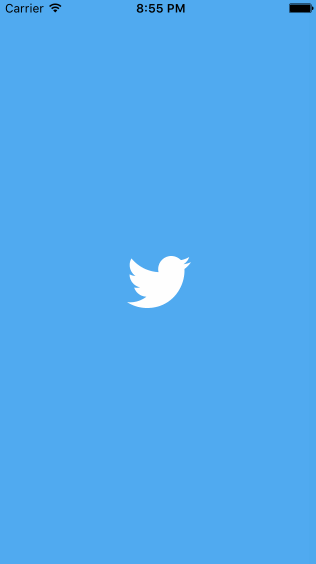

# Project 3 and 4 - *Twitter*

**Twitter** is a basic twitter app to read and compose tweets the [Twitter API](https://apps.twitter.com/).

## Week 3

Time spent: **9** hours spent in total

### User Stories

The following **required** functionality is completed:

- [x] User can sign in using OAuth login flow.
- [x] User can view last 20 tweets from their home timeline.
- [x] The current signed in user will be persisted across restarts.
- [x] In the home timeline, user can view tweet with the user profile picture, username, tweet text, and timestamp.  In other words, design the custom cell with the proper Auto Layout settings.  You will also need to augment the model classes.
- [x] User can pull to refresh.
- [x] User can compose a new tweet by tapping on a compose button.
- [x] User can tap on a tweet to view it, with controls to retweet, favorite, and reply.

The following **optional** features are implemented:

- [x] When composing, you should have a countdown in the upper right for the tweet limit.
- [x] After creating a new tweet, a user should be able to view it in the timeline immediately without refetching the timeline from the network.
- [x] Retweeting and favoriting should increment the retweet and favorite count.
- [x] User should be able to unretweet and unfavorite and should decrement the retweet and favorite count.
- [x] Replies should be prefixed with the username and the reply_id should be set when posting the tweet,
- [x] User can load more tweets once they reach the bottom of the feed using infinite loading similar to the actual Twitter client.

The following **additional** features are implemented:

- [ ] List anything else that you can get done to improve the app functionality!

### Video Walkthrough

Here's a walkthrough of implemented user stories:

GIF created with [LiceCap](http://www.cockos.com/licecap/).

## Week 4

Time spent: **7** hours spent in total

### User Stories

The following **required** functionality is completed:

- [x] Hamburger menu
   - [x] Dragging anywhere in the view should reveal the menu.
   - [x] The menu should include links to your profile, the home timeline, and the mentions view.
   - [x] The menu can look similar to the LinkedIn menu below or feel free to take liberty with the UI.
- [x] Profile page
   - [x] Contains the user header view
   - [x] Contains a section with the users basic stats: # tweets, # following, # followers
- [x] Home Timeline
   - [x] Tapping on a user image should bring up that user's profile page

The following **optional** features are implemented:

- [ ] Profile Page
   - [ ] Implement the paging view for the user description.
   - [ ] As the paging view moves, increase the opacity of the background screen. See the actual Twitter app for this effect
   - [x] Pulling down the profile page should blur and resize the header image.
- [ ] Account switching
   - [ ] Long press on tab bar to bring up Account view with animation
   - [ ] Tap account to switch to
   - [ ] Include a plus button to Add an Account
   - [ ] Swipe to delete an account

### Video Walkthrough

Here's a walkthrough of implemented user stories:

GIF created with [LiceCap](http://www.cockos.com/licecap/).

## License

    Copyright 2015 Juan Pablo Marzetti

    Licensed under the Apache License, Version 2.0 (the "License");
    you may not use this file except in compliance with the License.
    You may obtain a copy of the License at

        http://www.apache.org/licenses/LICENSE-2.0

    Unless required by applicable law or agreed to in writing, software
    distributed under the License is distributed on an "AS IS" BASIS,
    WITHOUT WARRANTIES OR CONDITIONS OF ANY KIND, either express or implied.
    See the License for the specific language governing permissions and
    limitations under the License.
